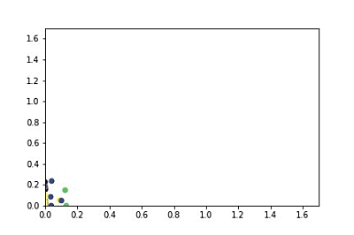

# keras-graph-convolution-layer
Thomas N. Kipf, Max Welling, [Semi-Supervised Classification with Graph Convolutional Networks](http://arxiv.org/abs/1609.02907) (ICLR 2017)
https://github.com/tkipf/keras-gcn is not work in my envirement.  
So , I rebuilt a simple one to test GCN. 

envirement:
Pyhton3.7
tensorflow 1.13.1
keras 2.3.1  

